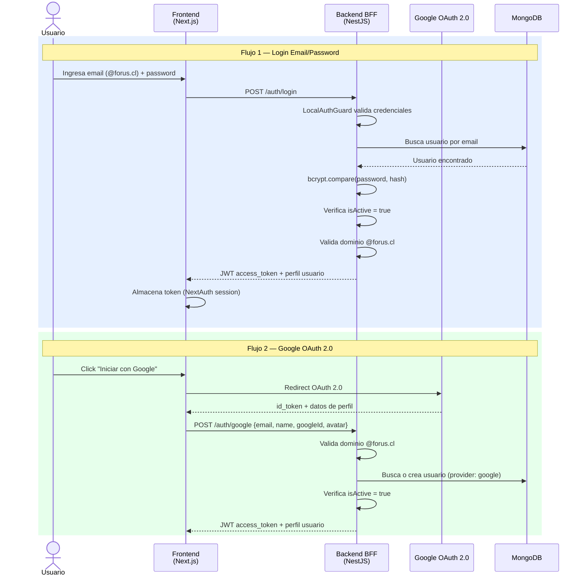
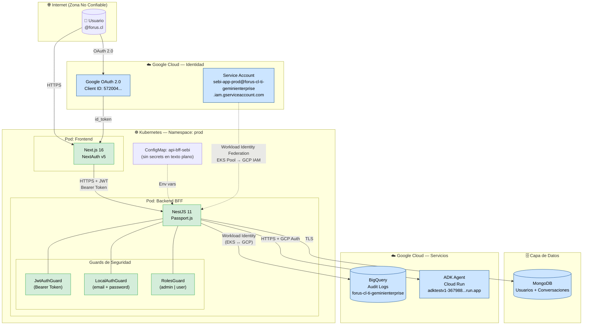
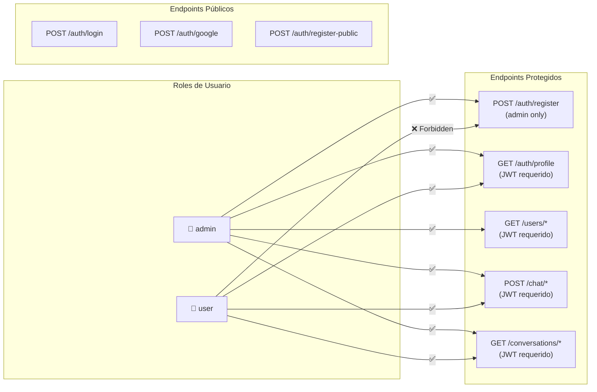
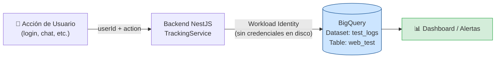
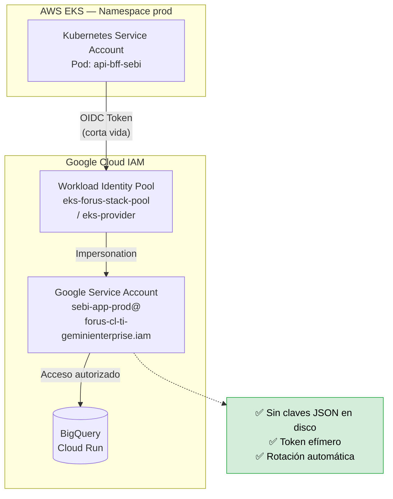

# Diagrama de Seguridad — SEBI App

> Arquitectura de seguridad de la aplicación SEBI para el equipo de Ciberseguridad.

---

## 1. Flujo de Autenticación

---

## 2. Arquitectura de Seguridad — Vista General

---

## 3. Modelo de Control de Acceso (RBAC)

---

## 4. Flujo de Auditoría y Trazabilidad

---

## 5. Workload Identity Federation (EKS → GCP)

---

## 6. Resumen de Controles de Seguridad

| Control | Implementación | Estado |
|---|---|---|
| Autenticación | JWT (Passport.js) + Google OAuth 2.0 | ✅ Activo |
| Contraseñas | bcrypt (salt rounds: 10) | ✅ Activo |
| Restricción de dominio | Solo `@forus.cl` permitido | ✅ Activo |
| Autorización | RBAC (roles: `admin`, `user`) | ✅ Activo |
| Gestión de credenciales GCP | Workload Identity Federation (sin JSON key) | ✅ Activo |
| Auditoría de eventos | BigQuery (login, acciones de usuario) | ✅ Activo |
| Transporte | HTTPS en todos los endpoints externos | ✅ Requerido |
| Secrets en Kubernetes | ConfigMap (sin secrets en texto plano) | ⚠️ Revisar uso de K8s Secrets |
| Cuenta desactivada | Verificación `isActive` en login | ✅ Activo |
| Rate limiting | No detectado | ⚠️ Pendiente evaluar |
| CORS | No revisado en este diagrama | ⚠️ Verificar configuración |
